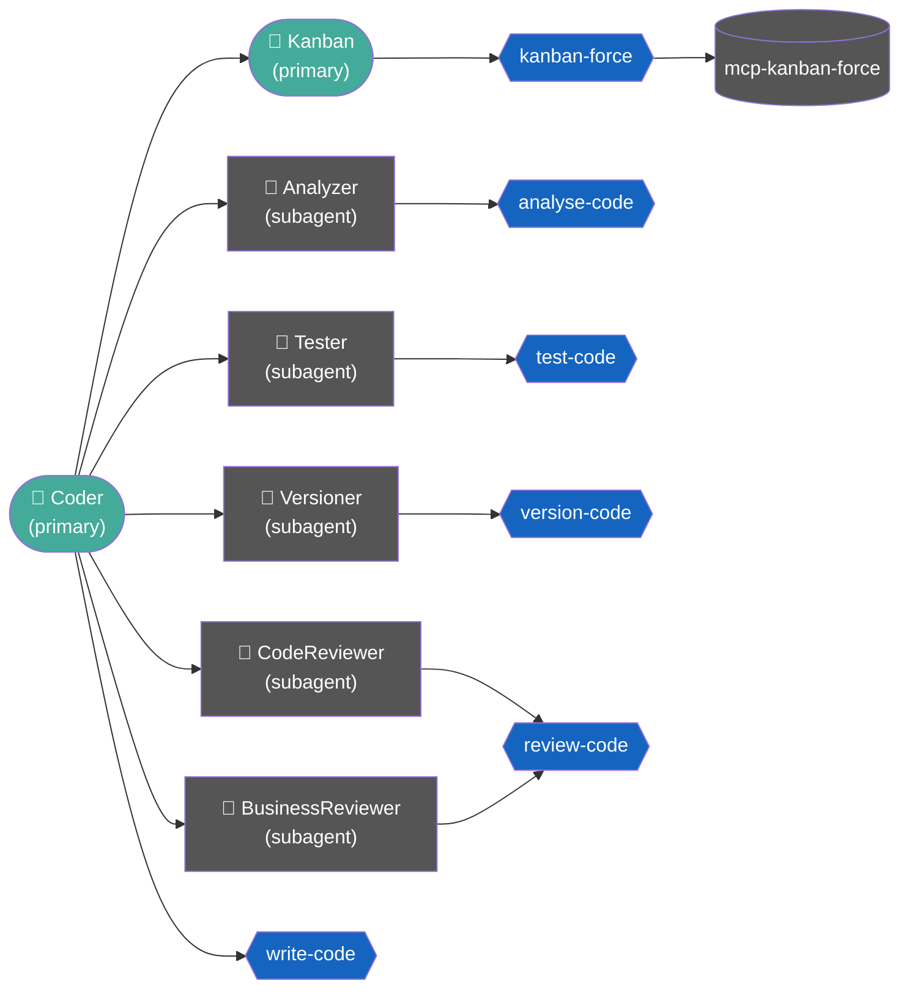

# coder

Conjunto de agentes e skills para [OpenCode](https://opencode.ai) que implementa um fluxo disciplinado de desenvolvimento de software com análise prévia, TDD, revisão técnica, revisão de segurança e versionamento controlado.

## Commands

| Command | Uso | Descrição |
|---|---|---|
| `/doc-plan` | `/doc-plan` | Publica `.coder/plan.md` no Confluence (space CAT, subpágina de Implementações) via MCP `atlassian_local`; ignora se não houver diferenças |
| `/get-plan` | `/get-plan` | Baixa o plano de implementação do Confluence e salva em `.coder/plan.md`; cria o arquivo se não existir |
| `/kanban-card` | `/kanban-card <friendlyID>` | Consulta um card pelo friendlyID via MCP `kanban-force` e carrega todas as informações no contexto (ignora cards arquivados) |
| `/mr-review` | `/mr-review` | Aciona o `mr_reviewer` para revisar o Merge Request aberto na branch atual via `glab` |

## Agentes

| Agente | Mode | Função |
|---|---|---|
| `coder` | primary | Orquestrador principal — coordena subagentes de desenvolvimento e delega operações de card/board ao `kanban` |
| `lead` | primary | Orquestrador de planejamento — gera `.coder/tasks.md` e delega implementação ao `coder` após aprovação |
| `documenter` | primary | Publica planos de implementação no Confluence via MCP `atlassian_local` |
| `kanban` | primary | Gerenciamento de cards e boards via MCP `kanban-force` |
| `infra` | primary | Consulta aplicações no ArgoCD |
| `mr_reviewer` | primary | Revisa Merge Requests do GitLab via CLI `glab` |
| `analyzer` | subagent | Inspeciona a codebase antes de qualquer modificação |
| `clarifier` | subagent | Formata perguntas de ambiguidade com opções e recomendação |
| `planner` | subagent | Produz o TaskGraph esqueleto a partir da intenção esclarecida |
| `detailer` | subagent | Enriquece cada task com preview, testes, critérios e contrato |
| `tester` | subagent | Cria e executa testes com abordagem TDD |
| `code_reviewer` | subagent | Revisão técnica de código — Camada 1 |
| `business_reviewer` | subagent | Revisão de negócio e segurança — Camada 2 |
| `versioner` | subagent | Executa operações Git com confirmação explícita |

## Fluxo de desenvolvimento



Quando a solicitação contiver ID de card ou operação de board/card (criar, mover, atualizar, comentar, bloquear, arquivar etc.), o `coder` delega ao `kanban`, que opera via MCP `kanban-force`. Para solicitações mistas, o `kanban` executa primeiro e o fluxo de código segue depois.

O `tester` é acionado em dois momentos distintos: antes da implementação para criar os testes que devem falhar (fase red do TDD) e depois da implementação para confirmar que todos passam (fase green). Nenhum código é versionado sem o parecer final do `business_reviewer`.

## Instalação

### Via curl (recomendado)

```bash
curl -fsSL https://raw.githubusercontent.com/paraizofelipe/coder/main/install.sh | bash
```

### Via wget

```bash
wget -qO- https://raw.githubusercontent.com/paraizofelipe/coder/main/install.sh | bash
```

### A partir do repositório local

Clone o repositório e execute o script com a flag `--local`:

```bash
git clone https://github.com/paraizofelipe/coder.git
cd coder
./install.sh --local
```

## Seleção de vendor

Ao iniciar, o instalador exibe um menu interativo para escolher o vendor de IA. A escolha define os modelos usados em todos os agentes:

```
[info]  Selecione o vendor de modelos:

        1) anthropic        main: anthropic/claude-sonnet-4-6
        2) openai           main: openai/gpt-5.5
        3) google           main: google/gemini-2.5-pro
        4) groq             main: groq/llama-3.3-70b-versatile
        5) amazon-bedrock   main: amazon-bedrock/amazon.nova-pro-v1:0
        6) github-copilot   main: github-copilot/claude-sonnet-4.6

[?]    Número do vendor [1-6]:
```

O modelo **main** é aplicado a todos os agentes **primários** (`coder`, `lead`, `documenter`, `kanban`, `infra`, `mr_reviewer`). Agentes **subagentes** (`analyzer`, `clarifier`, `planner`, `detailer`, `tester`, `code_reviewer`, `business_reviewer`, `versioner`) não recebem `model` no frontmatter e herdam o modelo do agente que os aciona.

> Para verificar os modelos disponíveis no seu ambiente: `opencode models <vendor>`

## Opções do instalador

| Flag | Descrição |
|---|---|
| `--force`, `-f` | Substitui todos os arquivos sem perguntar |
| `--local`, `-l` | Instala a partir dos arquivos locais do repositório clonado |
| `--help`, `-h` | Exibe a ajuda |

### Exemplo: forçar substituição

```bash
curl -fsSL https://raw.githubusercontent.com/paraizofelipe/coder/main/install.sh | bash -s -- --force
```

## Checagem antes de instalar

O instalador verifica, para cada agente e skill, se já existe um arquivo com o mesmo nome no diretório de destino. Quando encontra um conflito, exibe um aviso e pergunta se deve substituir:

```
[warn]  Já existe: /home/user/.config/opencode/agents/coder.md
[?]    Substituir coder.md? [s/N]
```

Responda `s` para substituir ou pressione Enter para pular.

## Diretórios de instalação

Por padrão, os arquivos são instalados em:

```
~/.config/opencode/agents/    ← agentes (um arquivo <nome>.md montado por agente)
~/.config/opencode/skills/    ← skills (um subdiretório <nome>/ com SKILL.md por skill)
~/.config/opencode/commands/  ← commands (um arquivo <nome>.md montado por command)
```

Para instalar em outro diretório, defina a variável `OPENCODE_DIR` antes de executar:

```bash
OPENCODE_DIR=/caminho/personalizado curl -fsSL https://raw.githubusercontent.com/paraizofelipe/coder/main/install.sh | bash
```

## Requisitos

- [OpenCode](https://opencode.ai) instalado
- `curl` ou `wget` (para instalação remota)
- `bash` >= 4.0
- MCP `kanban-force` configurado (necessário para operações de board/card com o agente `kanban`)

## Modelos configurados

Os modelos são definidos durante a instalação conforme o vendor escolhido. Apenas os agentes **primários** recebem `model` no frontmatter. Os **subagentes** não têm `model` definido e herdam o modelo do agente que os aciona.

**Agentes primários:** `coder`, `lead`, `documenter`, `kanban`, `infra`, `mr_reviewer`

**Subagentes (herdam):** `analyzer`, `clarifier`, `planner`, `detailer`, `tester`, `code_reviewer`, `business_reviewer`, `versioner`

| Vendor | main (primários) |
|---|---|
| `anthropic` | `anthropic/claude-sonnet-4-6` |
| `openai` | `openai/gpt-5.5` |
| `google` | `google/gemini-2.5-pro` |
| `groq` | `groq/llama-3.3-70b-versatile` |
| `amazon-bedrock` | `amazon-bedrock/amazon.nova-pro-v1:0` |
| `github-copilot` | `github-copilot/claude-sonnet-4.6` |
