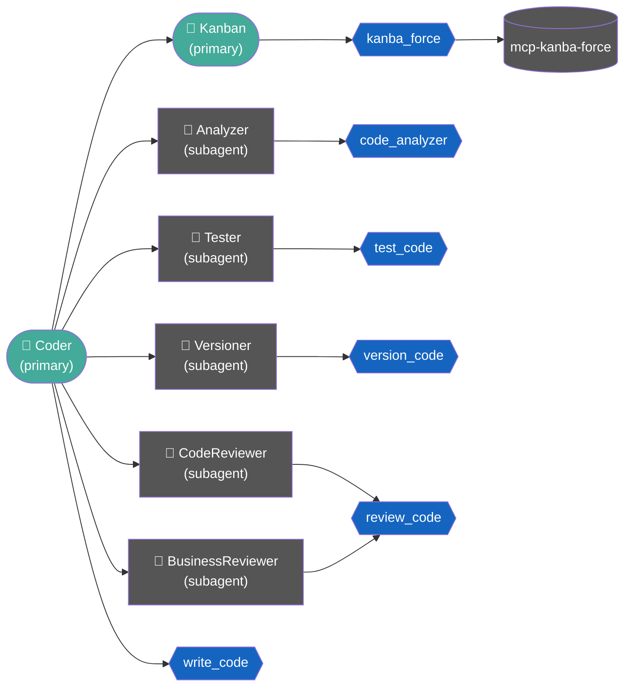

# coder

Conjunto de agentes e skills para [OpenCode](https://opencode.ai) que implementa um fluxo disciplinado de desenvolvimento de software com análise prévia, TDD, revisão técnica, revisão de segurança e versionamento controlado.

## Agentes

| Agente | Função |
|---|---|
| `coder` | Orquestrador principal — coordena subagentes de desenvolvimento e delega operações de card/board ao `kanban` |
| `kanban` | Agente primary para gerenciamento de cards e boards via MCP `kanban-force` |
| `analyzer` | Inspeciona a codebase antes de qualquer modificação |
| `tester` | Cria e executa testes com abordagem TDD |
| `code_reviewer` | Revisão técnica de código logo após a implementação |
| `business_reviewer` | Portão final de negócio e segurança antes do commit |
| `versioner` | Executa operações Git com confirmação explícita |

## Fluxo de desenvolvimento



Quando a solicitação contiver ID de card ou operação de board/card (criar, mover, atualizar, comentar, bloquear, arquivar etc.), o `coder` delega ao `kanban`, que opera via MCP `kanban-force`. Para solicitações mistas, o `kanban` executa primeiro e o fluxo de código segue depois.

O `tester` é acionado em dois momentos distintos: antes da implementação para criar os testes que devem falhar (fase red do TDD) e depois da implementação para confirmar que todos passam (fase green). Nenhum código é versionado sem o parecer final do `business_reviewer`.

## Instalação

### Via curl (recomendado)

```bash
curl -fsSL https://raw.githubusercontent.com/paraizofelipe/coder/main/install.sh | bash
```

### Via wget

```bash
wget -qO- https://raw.githubusercontent.com/paraizofelipe/coder/main/install.sh | bash
```

### A partir do repositório local

Clone o repositório e execute o script com a flag `--local`:

```bash
git clone https://github.com/paraizofelipe/coder.git
cd coder
./install.sh --local
```

## Seleção de vendor

Ao iniciar, o instalador exibe um menu interativo para escolher o vendor de IA. A escolha define os modelos usados em todos os agentes:

```
[info]  Selecione o vendor de modelos:

        1) anthropic        main: anthropic/claude-sonnet-4-6        light: anthropic/claude-haiku-4-5
        2) openai           main: openai/gpt-4o                      light: openai/gpt-4o-mini
        3) google           main: google/gemini-2.5-pro              light: google/gemini-2.5-flash
        4) groq             main: groq/llama-3.3-70b-versatile       light: groq/llama-3.1-8b-instant
        5) amazon-bedrock   main: amazon-bedrock/amazon.nova-pro-v1:0  light: amazon-bedrock/amazon.nova-lite-v1:0
        6) github-copilot   main: github-copilot/claude-sonnet-4.6   light: github-copilot/gpt-4.1

[?]    Número do vendor [1-6]:
```

O modelo **main** é aplicado aos agentes de análise, desenvolvimento e revisão. O modelo **light** é aplicado ao `versioner`, que executa apenas operações Git simples.

> Para verificar os modelos disponíveis no seu ambiente: `opencode models <vendor>`

## Opções do instalador

| Flag | Descrição |
|---|---|
| `--force`, `-f` | Substitui todos os arquivos sem perguntar |
| `--local`, `-l` | Instala a partir dos arquivos locais do repositório clonado |
| `--help`, `-h` | Exibe a ajuda |

### Exemplo: forçar substituição

```bash
curl -fsSL https://raw.githubusercontent.com/paraizofelipe/coder/main/install.sh | bash -s -- --force
```

## Checagem antes de instalar

O instalador verifica, para cada agente e skill, se já existe um arquivo com o mesmo nome no diretório de destino. Quando encontra um conflito, exibe um aviso e pergunta se deve substituir:

```
[warn]  Já existe: /home/user/.opencode/agents/coder.md
[?]    Substituir coder.md? [s/N]
```

Responda `s` para substituir ou pressione Enter para pular.

## Diretórios de instalação

Por padrão, os arquivos são instalados em:

```
~/.opencode/agents/   ← agentes
~/.opencode/skills/   ← skills
```

Para instalar em outro diretório, defina a variável `OPENCODE_DIR` antes de executar:

```bash
OPENCODE_DIR=/caminho/personalizado curl -fsSL https://raw.githubusercontent.com/paraizofelipe/coder/main/install.sh | bash
```

## Requisitos

- [OpenCode](https://opencode.ai) instalado
- `curl` ou `wget` (para instalação remota)
- `bash` >= 4.0
- MCP `kanban-force` configurado (necessário para operações de board/card com o agente `kanban`)

## Modelos configurados

Os modelos são definidos durante a instalação conforme o vendor escolhido. Os agentes são divididos em dois grupos:

| Grupo | Agentes | Motivo |
|---|---|---|
| **main** | `coder`, `kanban`, `analyzer`, `tester`, `code_reviewer`, `business_reviewer` | Tarefas complexas de orquestração, análise, desenvolvimento e operações Kanban |
| **light** | `versioner` | Operações Git simples |

| Vendor | main | light |
|---|---|---|
| `anthropic` | `anthropic/claude-sonnet-4-6` | `anthropic/claude-haiku-4-5` |
| `openai` | `openai/gpt-4o` | `openai/gpt-4o-mini` |
| `google` | `google/gemini-2.5-pro` | `google/gemini-2.5-flash` |
| `groq` | `groq/llama-3.3-70b-versatile` | `groq/llama-3.1-8b-instant` |
| `amazon-bedrock` | `amazon-bedrock/amazon.nova-pro-v1:0` | `amazon-bedrock/amazon.nova-lite-v1:0` |
| `github-copilot` | `github-copilot/claude-sonnet-4.6` | `github-copilot/gpt-4.1` |
