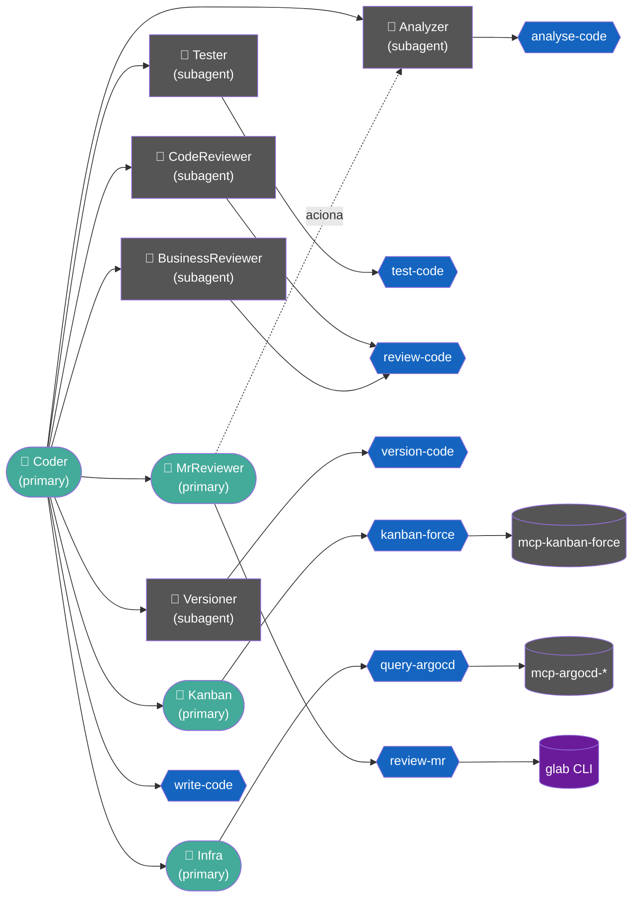

# coder

Coleção de **agentes** e **skills** para [OpenCode](https://opencode.ai), [Claude Code](https://claude.ai/code), [Codex](https://github.com/openai/codex) e [Pi](https://github.com/earendil-works/pi-coding-agent) que implementa um fluxo disciplinado de desenvolvimento de software assistido por IA: análise prévia da codebase, TDD, revisão técnica, revisão de negócio/segurança e versionamento controlado — com calibração do esforço ao impacto real de cada mudança.

As skills seguem o padrão aberto [**Agent Skills**](https://agentskills.io/specification), portável entre os quatro harnesses. Os agentes são instalados no formato nativo de cada um. O repositório é **somente Markdown + um shell script** (`install.sh`) — sem código executável, dependências ou build.

## Índice

- [Conceitos](#conceitos)
- [Estrutura do repositório](#estrutura-do-repositório)
- [Agentes](#agentes)
- [Skills](#skills)
- [Commands](#commands)
- [Integrações externas](#integrações-externas)
- [Fluxos de orquestração](#fluxos-de-orquestração)
- [Instalação](#instalação)
- [Diretórios de instalação](#diretórios-de-instalação)
- [Opções do instalador](#opções-do-instalador)
- [Modelos configurados](#modelos-configurados)
- [Artefatos gerados](#artefatos-gerados)
- [Requisitos](#requisitos)
- [Convenções do projeto](#convenções-do-projeto)

## Conceitos

- **Skill** — uma pasta `skills/<nome>/SKILL.md` no padrão [Agent Skills](https://agentskills.io/specification): metadados (`name` em kebab-case, `description`) + instruções operacionais passo a passo. É a unidade portável, igual nos quatro harnesses.
- **Agente** — um papel de orquestração com um prompt de sistema e regras de comportamento. É um conceito **nativo de cada harness** (OpenCode e Claude Code têm subagentes; o Codex e o Pi usam o `AGENTS.md` como guia de orquestração). Cada agente normalmente aciona uma skill.
- **Primário (`primary`)** — agente com o qual o usuário interage diretamente; é o ponto de entrada de uma solicitação.
- **Subagente (`subagent`)** — agente delegado, acionado por um primário para uma tarefa especializada (análise, testes, revisão, versionamento).

## Estrutura do repositório

Layout **híbrido**: o corpo dos agentes é único e agnóstico de harness; só o frontmatter varia por harness. As skills são pastas no padrão Agent Skills.

```text
agents/
  <nome>/
    body.md         # prompt do agente (XML tags), compartilhado entre harnesses
    opencode.yml    # frontmatter OpenCode (description, mode, [model], temperature)
    claude.yml      # frontmatter Claude Code (name, description, [model])
skills/
  <kebab-name>/
    SKILL.md        # name + description + instruções (padrão Agent Skills)
    references/     # (opcional) material consultado sob demanda
commands/
  <kebab-name>/
    body.md         # corpo do slash command (template do prompt)
    opencode.yml    # frontmatter (description, agent)
    claude.yml      # frontmatter (description)
    pi.yml          # frontmatter Pi (description, [argument-hint])
AGENTS.md           # guia de orquestração (também instalado no Codex e no Pi)
install.sh          # instalador multi-harness
```

O `install.sh` **monta** o arquivo final de cada agente/command juntando `<harness>.yml` + `body.md`, e copia as skills como pastas completas. Veja [Diretórios de instalação](#diretórios-de-instalação).

## Agentes

| Agente | Mode | Skill | Papel |
|---|---|---|---|
| `coder` | primary | `write-code` | Orquestrador principal de implementação — tria o impacto, aciona os subagentes de desenvolvimento e escreve o código de produção |
| `lead` | primary | `plan-implementation` | Orquestrador de planejamento — recebe feature/bug, quebra em tasks revisáveis (`.coder/task-AAAAMMDD-HHMMSS.md`) e delega a implementação ao `coder` após aprovação |
| `documenter` | primary | `document-plan`, `get-plan` | Publica e sincroniza planos de implementação com o Confluence via MCP `atlassian_local` |
| `kanban` | primary | `kanban-force` | Cria, move, atualiza e organiza cards em boards via MCP `kanban-force` |
| `infra` | primary | `query-argocd` | Consulta aplicações no ArgoCD (status, logs, sincronizações, eventos) via MCPs `argocd-*` |
| `mr_reviewer` | primary | `review-mr` | Revisa Merge Requests do GitLab via CLI `glab` — prepara uma worktree isolada da branch do MR em `.wt/`, lê diff/comentários, aciona o `analyzer` e responde/aprova sob confirmação |
| `qa` | primary | `validate-implementation` | Valida funcionalmente as modificações da branch (smoke/black-box/e2e/regressão) contra serviços reais; aciona `analyzer`/`infra`; grava o plano em `.coder/tests-*.md`; executa em HML sob confirmação |
| `analyzer` | subagent | `analyse-code` | Inspeciona a codebase (estrutura, padrões, convenções, testes) antes de qualquer modificação |
| `clarifier` | subagent | `clarify-intent` | Transforma ambiguidades brutas do `analyzer` em perguntas com opções e recomendação justificada |
| `planner` | subagent | `plan-tasks` | Produz o TaskGraph esqueleto (tasks com dependências e riscos) a partir da intenção esclarecida |
| `detailer` | subagent | `detail-tasks` | Enriquece cada task com motivação, arquivos, preview, estratégia de teste, critérios, contrato e esforço |
| `tester` | subagent | `test-code` | Cria e executa testes com abordagem TDD (fase red antes, fase green depois) |
| `code_reviewer` | subagent | `review-code` | Revisão técnica — Camada 1 (qualidade, padrões, cobertura de testes) |
| `business_reviewer` | subagent | `review-code` | Revisão de negócio e segurança — Camada 2 (regras de negócio, OWASP); portão final antes do versionamento |
| `versioner` | subagent | `version-code` | Executa operações Git (branch, worktree, commit, tag) somente com confirmação explícita |

A skill `review-code` é **compartilhada** pelo `code_reviewer` e pelo `business_reviewer` — o papel que a aciona define a camada (técnica ou negócio/segurança).

## Skills

| Skill | Agente(s) | O que faz |
|---|---|---|
| `write-code` | `coder` | Coordena o fluxo completo de desenvolvimento: análise, plano, TDD, implementação, revisão e versionamento |
| `plan-implementation` | `lead` | Orquestra análise, clarificação, planejamento e detalhamento até produzir `.coder/task-AAAAMMDD-HHMMSS.md` |
| `analyse-code` | `analyzer` | Inspeciona estrutura, frameworks, convenções, comandos e áreas impactadas; identifica ambiguidades |
| `clarify-intent` | `clarifier` | Formata ambiguidades em perguntas com opções concretas e recomendação baseada em evidências |
| `plan-tasks` | `planner` | Gera o TaskGraph executável (id, título, descrição, dependências, riscos) |
| `detail-tasks` | `detailer` | Enriquece cada task com preview, estratégia de testes, critérios de aceite, contrato e definition of done |
| `test-code` | `tester` | Cria testes que descrevem o comportamento esperado e os executa (red/green) |
| `review-code` | `code_reviewer`, `business_reviewer` | Revisão em duas camadas: técnica e negócio/segurança |
| `review-mr` | `mr_reviewer` | Revisa um MR do GitLab: worktree isolada da branch em `.wt/`, diff, comentários, parecer e ações via `glab` |
| `validate-implementation` | `qa` | Planeja e executa testes funcionais de QA sobre a branch (smoke/black-box/e2e/regressão), valida acessos aos serviços e reporta achados |
| `version-code` | `versioner` | Prepara commits, mensagens padronizadas e operações Git sob confirmação |
| `kanban-force` | `kanban` | Operações de card e board via MCP `kanban-force` |
| `query-argocd` | `infra` | Consultas a aplicações no ArgoCD via MCPs `argocd-*` |
| `document-plan` | `documenter` | Publica `.coder/plan.md` no Confluence via MCP `atlassian_local` |
| `get-plan` | `documenter` | Baixa o plano de implementação do Confluence para `.coder/plan.md` |

Para validar uma skill antes de commitar:

```bash
npx -y skills-ref validate ./skills/<nome>
```

## Commands

Slash commands invocáveis diretamente. Cada command é um subdiretório com `body.md` (template do prompt) + frontmatter por harness. Argumentos via `$ARGUMENTS` (todos) ou `$1`, `$2`… (posicionais).

| Command | Uso | Descrição |
|---|---|---|
| `/doc-plan` | `/doc-plan` | Publica `.coder/plan.md` no Confluence (space CAT, subpágina de Implementações) via MCP `atlassian_local`; ignora se não houver diferenças |
| `/get-plan` | `/get-plan` | Baixa o plano de implementação do Confluence e salva em `.coder/plan.md`; cria o arquivo se não existir |
| `/kanban-card` | `/kanban-card <friendlyID>` | Consulta um card pelo friendlyID via MCP `kanban-force` e carrega as informações no contexto (ignora cards arquivados) |
| `/mr-review` | `/mr-review <iid\|url>` | Aciona o `mr_reviewer` para revisar um Merge Request do GitLab via `glab` |
| `/qa` | `/qa [foco]` | Aciona o `qa` para validar funcionalmente as modificações da branch atual; monta plano em `.coder/tests-*.md`, valida acessos e executa em HML sob confirmação |

## Integrações externas

| Integração | Tipo | Usada por |
|---|---|---|
| `kanban-force` | MCP | `kanban` — cards e boards |
| `atlassian_local` | MCP | `documenter` — Confluence |
| `argocd-api-prod`, `argocd-worker-prod`, `argocd-hml` | MCP | `infra` — ArgoCD por ambiente |
| `glab` | CLI | `mr_reviewer` — Merge Requests do GitLab |

## Fluxos de orquestração

Há dois pontos de entrada primários, escolhidos conforme a necessidade: o **`coder`** (implementação direta, calibrada por impacto) e o **`lead`** (planejamento em tasks revisáveis antes de implementar).

Em **todos** os fluxos valem as guardas invariáveis: confirmação antes de tocar em arquivo, confirmação antes de versionar, nenhuma alteração em `main`/`master`, e a decisão sobre testes é sempre do `tester`.

### Coder — fluxo calibrado por impacto

O `coder` classifica a solicitação em um de quatro níveis **antes** de agir e anuncia o nível em 1 linha. Quanto maior o impacto, mais etapas do ciclo são acionadas.

| Nível | Critérios | Fluxo resumido |
|---|---|---|
| **Trivial** | Typo, doc, rename local, ≤ ~5 linhas em 1 arquivo, sem regra de negócio | resumo 1 linha → confirma → implementa → `tester` decide se cabe teste → confirma → `versioner` |
| **Pequena** | 1–2 arquivos, função isolada, bug com causa visível, sem mudança de API/negócio | `analyzer` focado (opcional) → plano inline → confirma → `tester` → implementa → `tester` executa → `code_reviewer` (opcional) → confirma → `versioner` |
| **Média** | 3–5 arquivos, comportamento contido, refactor localizado | `analyzer` focado → plano inline → confirma → `tester` → implementa → `tester` executa + regressão → `code_reviewer` → `business_reviewer` (se houver risco) → confirma → `versioner` |
| **Grande** | Nova feature, múltiplos módulos, segurança/auth/dados, regra de negócio, API pública, ambiguidade séria, > 5 arquivos | `analyzer` completo → `.coder/plan.md` + loop de ambiguidades → confirma → `tester` (red) → implementa → `tester` (green + regressão) → `code_reviewer` → `business_reviewer` (obrigatório) → confirma → `versioner` |

**Escalonamento obrigatório** (vira **Grande** independente do tamanho): autenticação, autorização, criptografia, secrets, schema/migrations, contratos de API/eventos, pagamento/billing, PII/PCI, ambiguidade no pedido ou falta de contexto para mapear arquivos. Em dúvida entre dois níveis, escolher o mais alto.



Quando a solicitação contiver ID de card ou operação de board/card, o `coder` delega ao `kanban` (que opera via MCP `kanban-force`); em solicitações mistas, o `kanban` executa primeiro e o fluxo de código segue depois. Para Merge Requests do GitLab, o `coder` delega ao `mr_reviewer`. O `tester` é acionado em dois momentos (red antes, green depois), e nenhum código é versionado sem o parecer final do `business_reviewer` nos níveis que o exigem.

### Lead — fluxo de planejamento

O `lead` é escolhido quando se quer **um plano técnico em tasks revisáveis antes de implementar** (feature nova, fix complexo, refactor que cruza módulos). Ele nunca escreve código de produção, nunca cria branch e nunca commita — após a aprovação, faz hand-off completo para o `coder`.

```text
lead
 ├─ analyzer  (analyse-code)      inspeciona a codebase, identifica ambiguidades brutas
 ├─ clarifier (clarify-intent)    formata perguntas com opções + recomendação (se houver amb.)
 ├─ <loop de decisões>            uma pergunta por vez, decisão registrada
 ├─ planner   (plan-tasks)        TaskGraph esqueleto (tasks + dependências + riscos)
 ├─ detailer  (detail-tasks)      enriquece cada task (preview, testes, critérios, contrato)
 ├─ grava .coder/task-*.md        documento canônico
 ├─ apresenta RESUMO (≤15 linhas)
 └─ aprovação explícita → delega ao coder
```

## Instalação

### Via curl (recomendado)

```bash
curl -fsSL https://raw.githubusercontent.com/paraizofelipe/coder/main/install.sh | bash
```

### Via wget

```bash
wget -qO- https://raw.githubusercontent.com/paraizofelipe/coder/main/install.sh | bash
```

### A partir do repositório local

```bash
git clone https://github.com/paraizofelipe/coder.git
cd coder
./install.sh --local
```

Ao executar, a primeira etapa é **selecionar o(s) harness(es)** de destino (OpenCode, Claude Code, Codex, Pi ou todos). Em seguida, se OpenCode estiver entre os selecionados, há a opção de escolher o vendor de modelos. Ambas as etapas podem ser puladas com as flags `--harness` e `--vendor`.

### Seleção de harness

```text
[info]  Selecione o(s) harness(es) de destino:
        1) opencode
        2) claude
        3) codex
        4) todos
        5) pi

[?]    Números separados por espaço (ex.: 1 2):
```

```bash
# instalar apenas no Claude Code
./install.sh --local --harness claude

# instalar no OpenCode e no Claude Code
./install.sh --local --harness opencode,claude

# instalar em todos
./install.sh --local --harness all
```

### Seleção de vendor

A seleção de vendor é **opcional** e **relevante apenas para o OpenCode**. Quando o OpenCode está entre os harnesses selecionados, o instalador pergunta o vendor (ou aceita Enter para o padrão `openai/gpt-5.5`):

```text
[info]  Vendor do OpenCode (Enter para usar o default openai/gpt-5.5):

        1) anthropic        main: anthropic/claude-sonnet-4-6
        2) openai           main: openai/gpt-5.5
        3) google           main: google/gemini-2.5-pro
        4) groq             main: groq/llama-3.3-70b-versatile
        5) amazon-bedrock   main: amazon-bedrock/amazon.nova-pro-v1:0
        6) github-copilot   main: github-copilot/claude-sonnet-4.6

[?]    Número do vendor [1-6] (Enter = padrão):
```

O vendor define o modelo aplicado aos agentes **primários** no OpenCode. Para pular o menu, use `--vendor`:

```bash
./install.sh --local --harness opencode --vendor anthropic
```

**Claude Code** usa `sonnet` para os primários, independentemente de vendor. **Codex** e **Pi** não recebem `model` por agente — o Codex herda o modelo da sessão e o Pi resolve via settings/provider.

> Para verificar os modelos disponíveis no seu ambiente OpenCode: `opencode models <vendor>`

## Diretórios de instalação

Os artefatos são instalados nos diretórios nativos de cada harness.

### OpenCode

| Tipo | Destino padrão |
|---|---|
| Agentes | `~/.config/opencode/agents/<nome>.md` (arquivo montado com frontmatter) |
| Skills | `~/.config/opencode/skills/<nome>/` (pasta com `SKILL.md`) |
| Commands | `~/.config/opencode/commands/<nome>.md` (arquivo montado com frontmatter) |

Override: `OPENCODE_DIR` (padrão: `~/.config/opencode`)

### Claude Code

| Tipo | Destino padrão |
|---|---|
| Agentes | `~/.claude/agents/<nome>.md` (arquivo montado com frontmatter) |
| Skills | `~/.claude/skills/<nome>/` (pasta com `SKILL.md`) |
| Commands | `~/.claude/commands/<nome>.md` (arquivo montado com frontmatter) |

Override: `CLAUDE_DIR` (padrão: `~/.claude`)

### Codex

| Tipo | Destino padrão |
|---|---|
| Skills | `~/.agents/skills/<nome>/` (pasta com `SKILL.md`) |
| Prompts (commands) | `~/.codex/prompts/<nome>.md` (apenas o corpo, sem frontmatter) |
| `AGENTS.md` | `~/.codex/AGENTS.md` (guia de orquestração) |

O Codex **não** recebe arquivos de agente — a orquestração é feita via `AGENTS.md`. Os commands viram prompts body-only.

Overrides: `CODEX_DIR` (padrão: `~/.codex`) e `CODEX_SKILLS_DIR` (padrão: `~/.agents/skills`)

### Pi

| Tipo | Destino padrão |
|---|---|
| Skills | `~/.agents/skills/<nome>/` (pasta com `SKILL.md`, compartilhado com o Codex) |
| Prompts (commands) | `~/.pi/agent/prompts/<nome>.md` (montado com frontmatter `pi.yml`) |
| `AGENTS.md` | `~/.pi/agent/AGENTS.md` (guia de orquestração) |

Como o Codex, o Pi **não** recebe arquivos de agente — a orquestração é feita via `AGENTS.md`. Diferente do Codex, os commands são montados com o frontmatter `pi.yml` (`description` + `argument-hint`), exibido no autocomplete do `/`.

As skills vão para `~/.agents/skills/` — o diretório do padrão Agent Skills que o Pi varre nativamente (além de `~/.pi/agent/skills/`) e que o Codex também usa. Instalá-las nesse local compartilhado evita o aviso de colisão de nomes que apareceria se as mesmas skills existissem nos dois diretórios quando Codex e Pi coexistem.

Overrides: `PI_DIR` (padrão: `~/.pi/agent`, usado para prompts e `AGENTS.md`) e `PI_SKILLS_DIR` (padrão: `~/.agents/skills`). Ao customizar `PI_SKILLS_DIR`, aponte para um diretório que o Pi varra (`~/.agents/skills` ou `~/.pi/agent/skills`); um caminho fora desses não é descoberto pelo Pi.

### Sobrescrevendo diretórios via variável de ambiente

```bash
OPENCODE_DIR=/caminho/customizado ./install.sh --local --harness opencode
CLAUDE_DIR=/outro/caminho ./install.sh --local --harness claude
CODEX_DIR=~/.meu-codex CODEX_SKILLS_DIR=~/.meu-codex/skills ./install.sh --local --harness codex
PI_DIR=~/.meu-pi/agent ./install.sh --local --harness pi
```

### Checagem antes de instalar

Para cada artefato, o instalador verifica se já existe destino com o mesmo nome. Em conflito, exibe um aviso e pergunta se deve substituir:

```text
[warn]  Já existe: /home/user/.claude/agents/coder.md
[?]    Substituir coder.md? [s/N]
```

Responda `s` para substituir ou pressione Enter para pular (`--force` substitui tudo sem perguntar).

## Opções do instalador

| Flag | Descrição |
|---|---|
| `--harness <lista>` | Harness(es) a instalar sem menu interativo. Valores: `opencode`, `claude`, `codex`, `pi`, `all` (separados por vírgula ou espaço, ex.: `opencode,claude`) |
| `--vendor <nome>` | Vendor para o OpenCode sem menu interativo. Valores: `anthropic`, `openai`, `google`, `groq`, `amazon-bedrock`, `github-copilot`. Inválido → erro + exit 1. Ignorado se OpenCode não estiver nos harnesses selecionados |
| `--force`, `-f` | Substitui todos os arquivos sem perguntar |
| `--local`, `-l` | Instala a partir dos arquivos locais do repositório clonado |
| `--help`, `-h` | Exibe a ajuda |

### Exemplos

```bash
# instalação interativa (recomendado para a primeira vez)
curl -fsSL https://raw.githubusercontent.com/paraizofelipe/coder/main/install.sh | bash

# forçar reinstalação sem confirmações, todos os harnesses, vendor openai
./install.sh --local --force --harness all --vendor openai

# instalar apenas no OpenCode e Claude Code, vendor anthropic
./install.sh --local --harness opencode,claude --vendor anthropic

# instalar apenas no Codex (sem vendor)
./install.sh --local --harness codex

# forçar substituição em modo remoto
curl -fsSL https://raw.githubusercontent.com/paraizofelipe/coder/main/install.sh | bash -s -- --force --harness claude
```

> **Atenção (Codex, modo remoto):** o `AGENTS.md` é gitignorado em alguns ambientes; quando ausente no GitHub, a instalação via `curl | bash` o pula com um aviso. Para garantir o `AGENTS.md`, use `--local`.

## Modelos configurados

Apenas os agentes **primários** recebem `model` no frontmatter. Os **subagentes** não têm `model` definido e herdam o modelo do agente que os aciona.

**Primários:** `coder`, `lead`, `documenter`, `kanban`, `infra`, `mr_reviewer`
**Subagentes (herdam):** `analyzer`, `clarifier`, `planner`, `detailer`, `tester`, `code_reviewer`, `business_reviewer`, `versioner`

| Harness | Vendor | Modelo dos primários |
|---|---|---|
| OpenCode | `anthropic` | `anthropic/claude-sonnet-4-6` |
| OpenCode | `openai` (padrão) | `openai/gpt-5.5` |
| OpenCode | `google` | `google/gemini-2.5-pro` |
| OpenCode | `groq` | `groq/llama-3.3-70b-versatile` |
| OpenCode | `amazon-bedrock` | `amazon-bedrock/amazon.nova-pro-v1:0` |
| OpenCode | `github-copilot` | `github-copilot/claude-sonnet-4.6` |
| Claude Code | — | `sonnet` |
| Codex | — | herdado da sessão |
| Pi | — | definido via settings/provider do Pi |

## Artefatos gerados

| Arquivo | Gerado por | Conteúdo |
|---|---|---|
| `.coder/plan.md` | `coder` (nível Grande) | Solicitação original, resumo da análise, tabela de ambiguidades com decisões, plano de ação e riscos |
| `.coder/task-AAAAMMDD-HHMMSS.md` | `lead` | Solicitação original, contexto técnico, decisões tomadas, riscos e tasks detalhadas |

Esses artefatos podem ser publicados/sincronizados com o Confluence pelos commands `/doc-plan` e `/get-plan`.

## Requisitos

- Um ou mais harnesses instalados: [OpenCode](https://opencode.ai), [Claude Code](https://claude.ai/code), [Codex](https://github.com/openai/codex) e/ou [Pi](https://github.com/earendil-works/pi-coding-agent)
- `curl` ou `wget` (para instalação remota)
- `bash` >= 4.0
- MCP `kanban-force` configurado (para operações de board/card com o `kanban`); demais integrações (Confluence, ArgoCD, GitLab) conforme os agentes utilizados

## Convenções do projeto

- **Idioma:** todo o conteúdo em português do Brasil.
- **Skills:** seguem o padrão [Agent Skills](https://agentskills.io/specification) — pasta com `SKILL.md`, `name` em kebab-case igual ao nome da pasta. Validar com `npx -y skills-ref validate ./skills/<nome>`.
- **Agentes:** corpo único em `body.md`; frontmatter separado por harness (`opencode.yml` usa `mode` e `temperature`; `claude.yml` usa `name` e, nos primários, `model: sonnet`).
- **Estrutura XML** nos prompts (`<role>`, `<workflow>`, `<rules>`, `<output_format>`, …); o `<output_format>` é o contrato de resposta de cada agente.
- **Commits:** Conventional Commits em inglês (`feat:`, `fix:`, `refactor:`, `docs:`, `chore:`, `style:`, `perf:`, `test:`).
